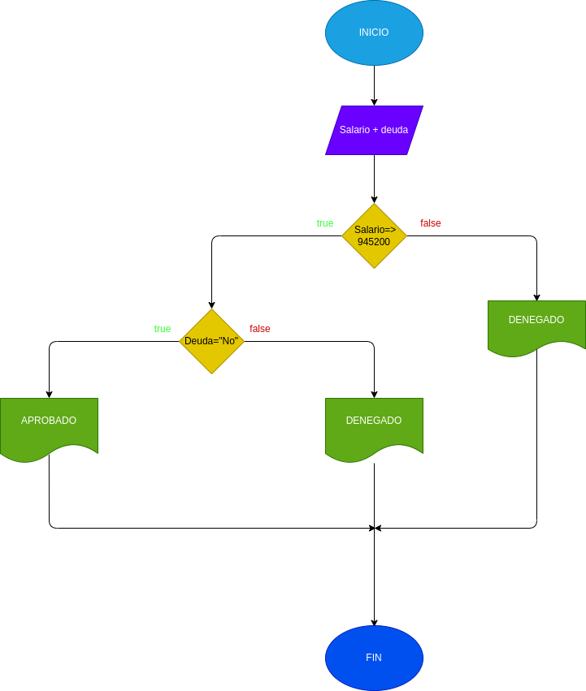

## Programa  Bancario
programa para si  usted puede adquirir un prestamo en el banco segun su salario y si tiene deudas anteriores
# ANALISIS

Variables de entrada

Salario = el dinero necesario para adquirir el prestamo
Deuda = saber si tiene deudas anteriores

variables del proceso 
salario >= numero ingresado
Deuda =  si o no  tienes deudas

variables de salida

Aceptado =  su prestamo fue Aceptado
Denegado = su prestamo fue Denegado

Nos indicara si se acepta o se denega su prestamo

# DISEÑO 

# CONSTRUCCION
