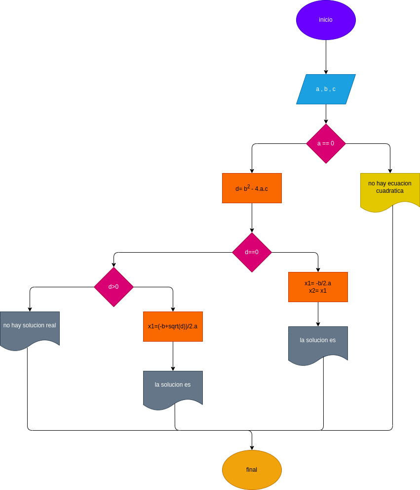

# ecuaciones cuadraticas
programa para calcular las raaices de la ecuación cuadratica de segundo grado de coeficientes reales

# ANALISIS
# variables de entrada

a = primer coeficiente
b = segundo coeficiente
c = tercer coeficiente
# variables de proceso

a es igual a 0?
hacer operacion d = b**2-4ac
d es igual a 0?
x1 = -b/(2*a)
x2 = x1
d > 0
x1. = (-b+sqrt(d))/(2*a)
x2. = (-b-sqrt(d))/(2*a)
d < 0
# variables de salida

si a es igual a 0 no es una ecuacion cuadratica
si d es igual a 0 los resultados son x1 y x2
si d es mayor a 0 los resultados son x1. y x2.
si d e menor que 0 no es una solucion real
# DISEÑO
