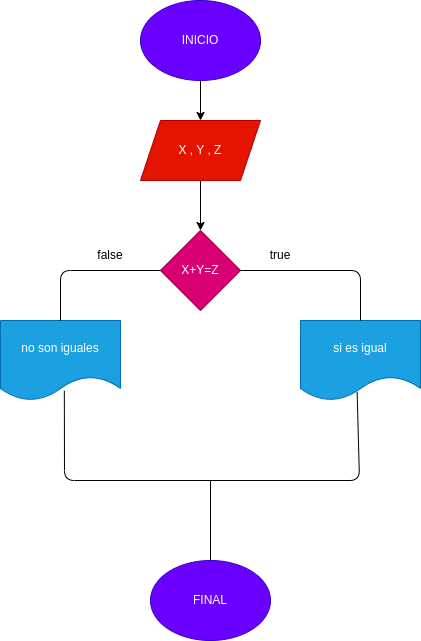

# SUMA_DOS_NUMERO_IGUAL_TERCERO
hacer un programa que reciba tres números y determine si la suma de los dos primeros es igual al tercero

# ANÁLISIS
variables de entrada X , Y ,Z

variables de proceso suma de x + y

variables de salida el tercer numero es igual a la suma de los dos primeros o no

# DISEÑO
